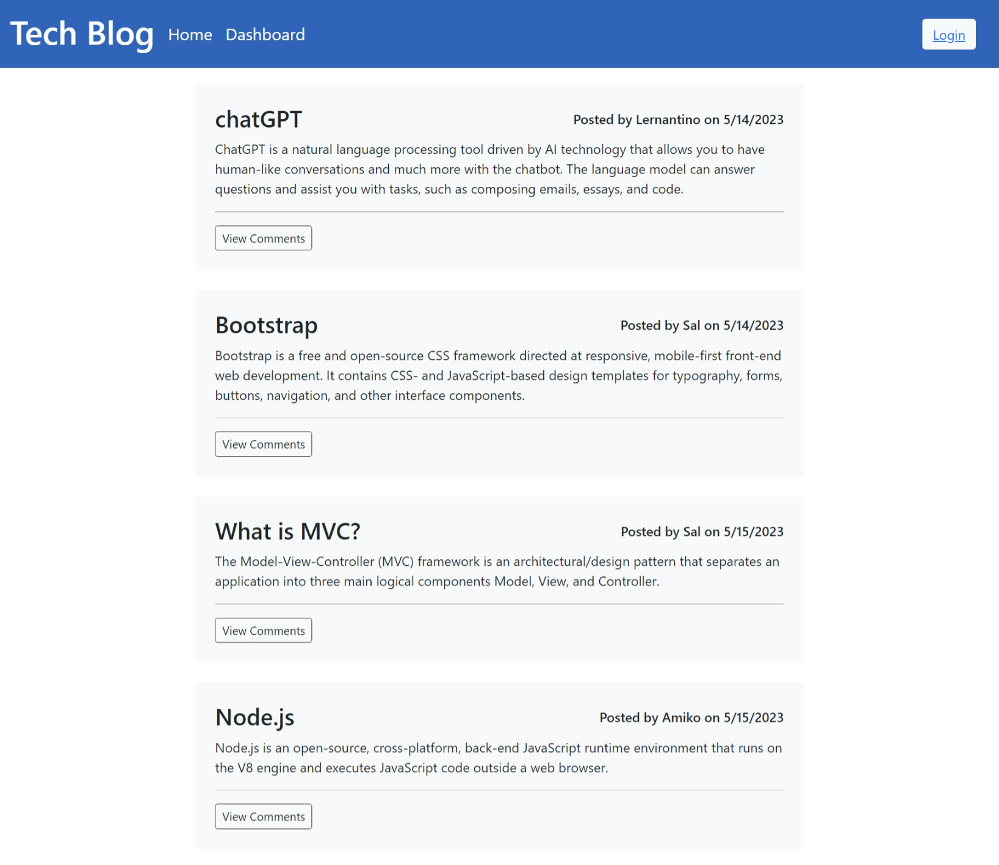

  
  # Note Taker

  ## Description

  This is a Tech Blog application where you can write blogs and post them. You can also read others blogs and also add comments to the blogs.  

  ## Table of Contents

  * [Installation](#installation)
  * [Usage](#usage)
  * [Project URL](#project-url)
  * [Project Image](#project-image)
  * [Credits](#credits)
  * [License](#license)
  * [Questions](#questions)
  
  ## Installation

  To run this application on your local machine, follow these steps:

    1. Download the code in your local machine and run `npm install` in the terminal to install all the dependencies.
    2. Define your database credentials in the .env file for connecting to the database.
    3. Run the files under db folder in mysql using `source ./db/schema.sql` command.
    4. Seed the database by running `npm run seed` in CLI.
    4. Start the server by running `npm start` in command prompt.
    5. Run the application in the browser by making a request to http://localhost:3001/.  

  ## Usage

  When you open the application in the browser, you can view blogs and comments without logging in. To view your dashboard you have to sign in. If you are a new user you can signup. Once you are logged in you can view dashboard, create new posts, edit and delete your previous posts. You can also add comments to others posts.
  

  ## Project URL

  URL link to the note-taker webpage:
  (https://saritha-note-taker.herokuapp.com/).

  ## Project Image
  
  The following image show the web application's appearance and functionality:

  

  ## Credits

  Built this application based on the knowledge gained from bootcamp activities.

  Used Bootstrap and MDBootstrap for frontend.

  ## License

  This project is licensed under the MIT license.

  ## Questions

   Check out the code and my other projects at [saritha2708](https://github.com/saritha2708).
   
   If you have any questions reach out to me at [saritha.2708@gmail.com](mailto:saritha.2708@gmail.com).

  